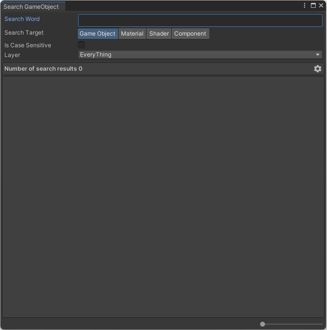
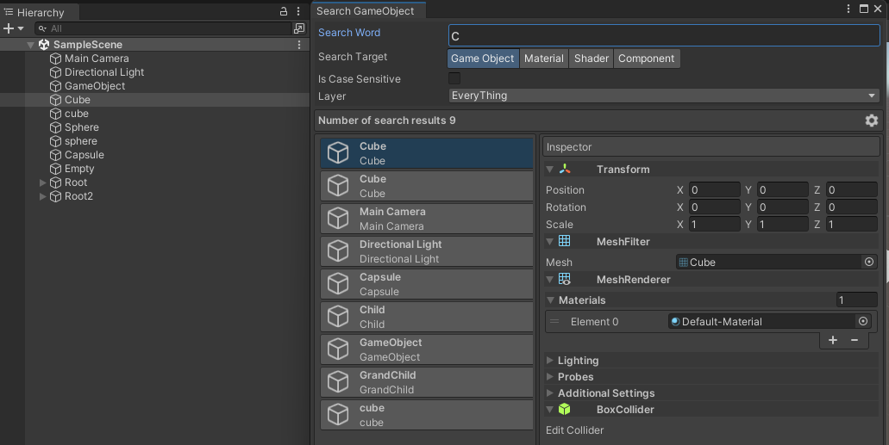
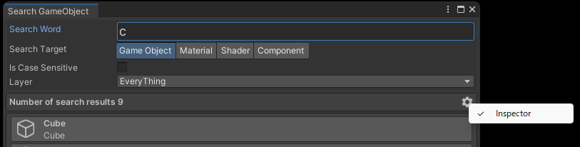
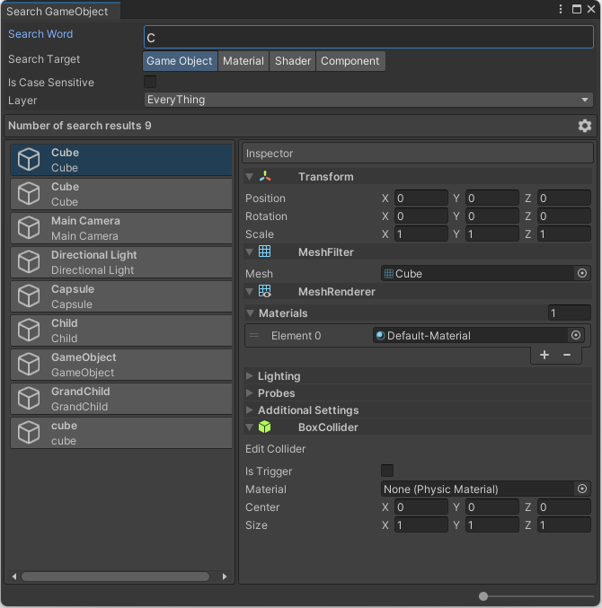
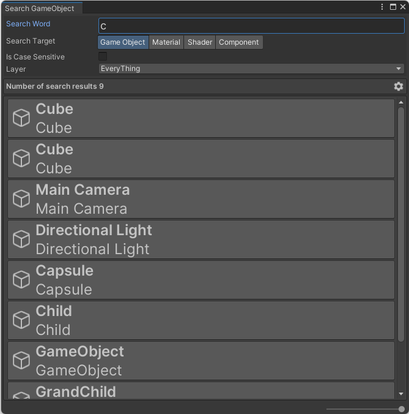

# SearchGameObjectWindow

UnityプロジェクトのHierarchy ウィンドウに作成されているGameObjectを検索する機能を提供します。

## インストール方法

- Git URL経由でのインストール
  - Package Managerから「Add package from git URL...」を選択する。
  - `https://github.com/prozolic/SearchGameObjectWindow.git?path=Assets/SearchGameObjectWindow` を入力後、Addボタンを押下する。

## 使用方法

### ウィンドウ表示

- Toolsメニュー → SearchGameObjectWindowメニューを押下する。

押下すると、「SearchGameObjectWindow」ウィンドウが表示されます。

Search Wordに文字入力することで検索処理が実行され、ウィンドウ内に検索結果が表示されます。

### 検索結果のGameObject

検索結果に表示されているGameObjectをクリックすると、Hierarchy ウィンドウ上でそのオブジェクトが選択されます。

### 検索範囲

- Hierarchy ウィンドウに配置されているGameObject

### 検索オプション

- 大文字小文字を区別した検索
- Layer単位での検索

### 検索対象

- Game Object
- Material
- Shader
- Component

### サブ機能

#### Inspector表示(デフォルト有効)

SearchGameObjectWindowで選択したGameObjectについて、Inspector ウィンドウに表示されている詳細情報を表示します。  

- 歯車アイコンをクリックします。
- Inspectorメニューをチェック状態にします。
- 検索結果に表示されているアイテムを選択します。

#### 検索結果アイテムのズーム率変更機能

検索結果に表示されている文字のサイズを変更することができます。

- SearchGameObjectWindow右下のスライダーを変更する。

## 最新バージョン

Ver.1.0.0

## 動作検証済 Unityバージョン

- Unity2021.3.12f1
- Unity2022.3.3f1

## ライセンス

[MIT License](LICENSE)
