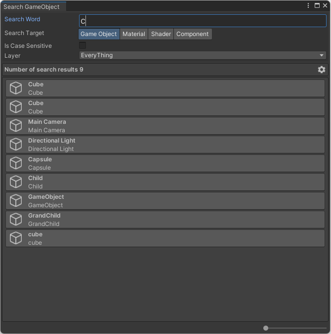

# SearchGameObjectWindow

UnityプロジェクトのHierarchy ウィンドウに作成されているGameObjectを検索する機能を提供します。

## インストール方法

- Git URL経由でのインストール
  - Package Managerから「Add package from git URL...」を選択する。
  - `https://github.com/prozolic/SearchGameObjectWindow.git?path=Assets/SearchGameObjectWindow` を入力後、Addボタンを押下する。

## 使用方法

### ウィンドウ表示

- Toolsメニュー → SearchGameObjectWindowメニューを押下する。

押下すると、「SearchGameObjectWindow」ウィンドウが表示されます。

Search wordに文字入力することで検索処理が実行され、ウィンドウ内に検索結果が表示されます。

### 検索結果のゲームオブジェクト

検索結果に表示されているゲームオブジェクトをクリックすると、Hierarchy ウィンドウ上でそのオブジェクトが選択されます。

### 検索範囲

- Hierarchy ウィンドウ

### 検索対象

- Game Object
- Material
- Shader
- Component

## Unityバージョン

Unity2021.3.12f1にて動作検証済

## ライセンス

[MIT License](LICENSE)